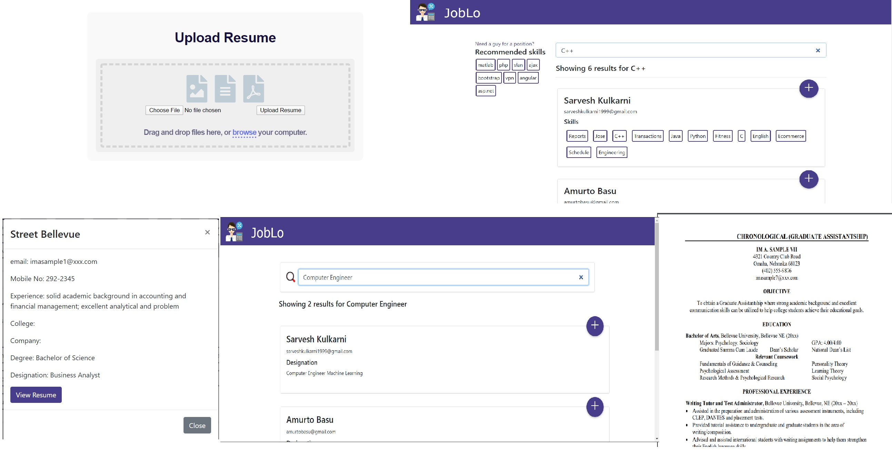

# JobLo
Recruitment Assistant using Job Profile Filtering and Web Scraping profiles from LinkedIn

# Table of Contents

* [Description](https://github.com/amurto/joblo#description)
* [Installation](https://github.com/amurto/joblo#installation)
  * [Prerequisites](https://github.com/amurto/joblo#prerequisites)
  * [Instructions](https://github.com/amurto/joblo#instructions)
* [Usage](https://github.com/amurto/joblo#usage)
* [License](https://github.com/amurto/joblo#license)

# Description

JobLo automates the process of a recruiter swiping through resumes by directly providing a dynamic interface with resumes segregated and classified as per the skillset using Resume Parser. The recruiters can use the search engine to filter out job profiles according to their requirements.

## Resume Parser
Full name extraction using spaCy.
Education extraction using NLTK corpus matching.
Email & phone number extraction using Regex.
Skills set extraction using spaCy. Rule-based matching against noun chunks.

## Recommendation System
Finding the most similar words using the GenSim Word2Vec model trained on a corpus of technical terms.

## Web Scraping
Scraping profiles from LinkedIn using Scrapy and Selenium.

## Designation Extraction 
NER tagger for scraping designation from the text using spaCy.
Matching entered keyword with a designation from filtered resumes.
 
## Webapp Images


# Installation

### Prerequisites

Install Python 3.6+ on the system

### Instructions

Clone the repository
```bash
git clone https://github.com/amurto/joblo.git
```

Install all the dependencies. Set up an environment if possible.
```bash
cd backend
pip install -r requirements.txt
```

Install all the dependencies on frontend.
```bash
cd frontend
npm install
```

# Usage

Start the backend server on port 5000.
```bash
cd backend
python app.py
```
Open a web browser and go to
```bash
http://localhost:5000/upload
```
Upload resumes ont his page

Run the webapp.
```bash
cd frontend
npm start
```

Open a web browser and go to
```bash
http://localhost:3000
```

Run the webcraper
```bash
cd backend
python scrape.py
```

# License

[](https://opensource.org/licenses/MIT)

[MIT License Link](https://github.com/amurto/joblo/blob/master/LICENSE)